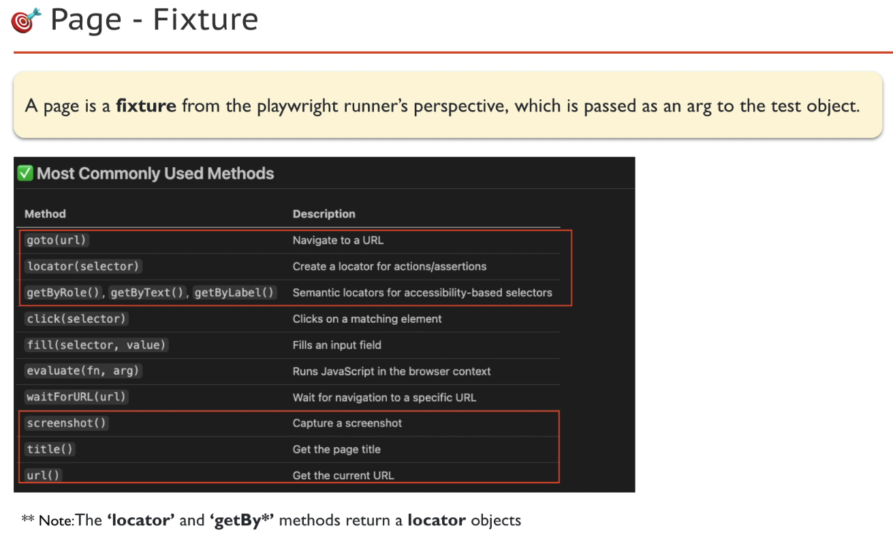
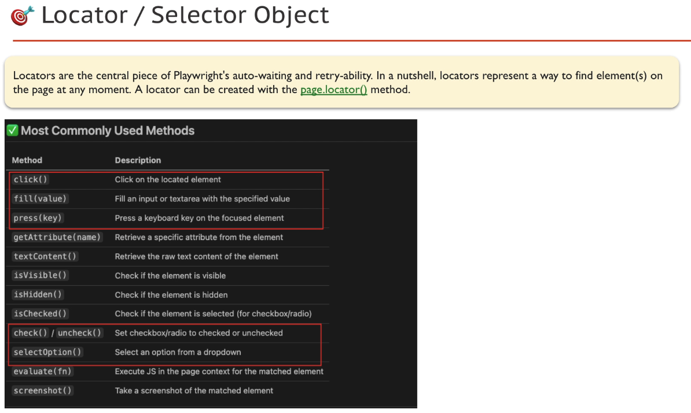
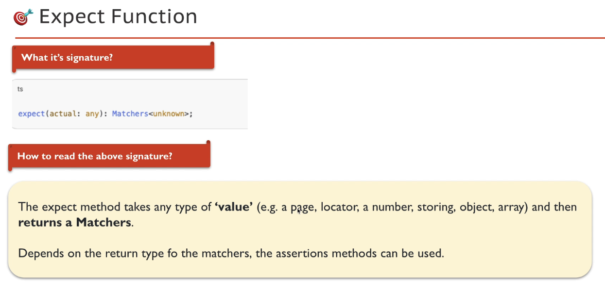
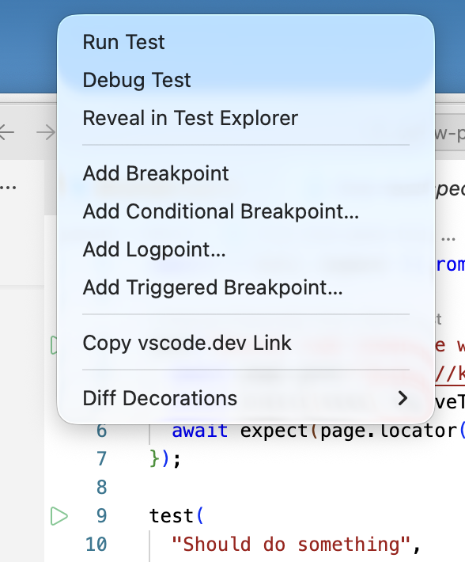
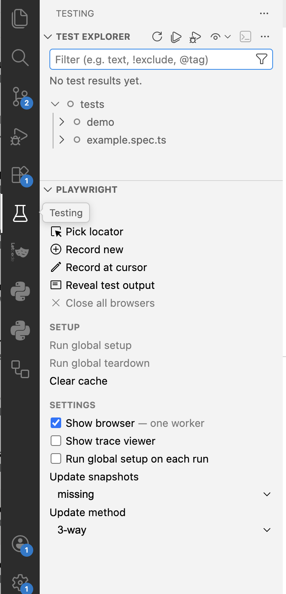

# Node.js Project Setup

## Steps

1. **Create a project folder:**

```sh
mkdir ~/Documents/workspace/playwright-e2e-tests
cd ~/Documents/workspace/playwright-e2e-tests
```

2. **Open in VS Code:**

```sh
code .
```

3. **Initialize Node.js project:**

```sh
npm init
```

- Complete the wizard. Ensure `package.json` is created.

4. **Create a sample file:**

```ts
// file name: hello.js
console.log("Hello World!");
```

5. **Run the code:**

```sh
node hello.js
# Output: Hello World!
```

# Playwright Installation

## Steps

1. **Check if Node.js is installed:**

```sh
node -v
```

- Returns a valid node version (e.g. `v22.16.0`). If not, install Node.js first.

2. **Navigate to your project directory:**

```sh
cd /path/to/your/project
```

3. **Initialize Playwright:**

```sh
npm init playwright@latest
```

- When prompted:
  - Select `TypeScript` as the language
  - Choose to install **all browsers**

4. **Verify Playwright installation:**

```sh
npx playwright --version
```

# Run the Generated Test

## Steps

1. **Run the sample test:**

```sh
npx playwright test --headed
```

- This command runs all Playwright tests in headed mode (browser UI visible).

2. **Show the test report:**

```sh
npx playwright show-report
```

- This command opens the Playwright HTML report for your test run.

---

**Note**: In Windows, If you get an error on running `webkit` browser, add the following config to ignore SSL cert

```ts
use: {
    ignoreHTTPSErrors: true,
  },
```

---

## Naming Convention - Best Practice:

### 16.2. File & Code Naming Conventions

| Item                    | Convention                         | Example                                               |
| ----------------------- | ---------------------------------- | ----------------------------------------------------- |
| **Folders / Files**     | kebab-case                         | `page-objects/`, `file-helper.ts`                     |
| **Page and Spec files** | dot-separated                      | `nopcommerce.home.page.ts`, `nopcommerce.e2e.spec.ts` |
| **Class Names**         | PascalCase (each word capitalized) | `LoginPage`, `DashboardActions`                       |
| **Variables**           | camelCase                          | `loginButton`, `userNameInput`                        |
| **Constants**           | UPPER_SNAKE_CASE                   | `BASE_URL`, `API_TIMEOUT_MS`                          |

---

🎯 **Consistent naming improves readability and reduces confusion across teams.**

---

# Folder Structure Setup

Let's create the following folder structure:

```sh
PLAYWRIGHT-E2E-TESTS/
├── .github/                    # CI Config folder
├── .vscode/                    # Editor-specific settings
│   └── mcp.json                # MCP server config for VS Code
├── config/                     # Environment-specific config files
├── data/                       # Static data and constants
│   └── constants.json          # Common constants used in tests
├── debug/                      # Optional: Debug-related outputs/logs
├── logs/                       # Application/test logs
├── node_modules/               # Auto-generated dependencies
├── playwright-report/          # Playwright HTML test report output
├── resources/                  # Misc test resources (e.g. images, files)
├── tests/                      # All organized test files
│   ├── api/                    # API test specs
│   ├── demo/                   # Demo-related test specs
│   ├── devices/                # Device related scenarios
│   ├── e2e/                    # End-to-end test specs
│   ├── functional/             # Functional test cases
│   ├── helpers/                # Utility functions for tests
│   ├── page-objects/           # Page Object Model files
├── tests-examples/             # Auto-generated sample test scenarios
├── .env.example                # Template for environment files
├── .env                        # Template for environment files
├── .gitignore                  # Git ignored files and folders
├── package-lock.json           # Dependency lock file
├── package.json                # Project metadata and scripts
├── playwright.config.ts        # Playwright configuration file
├── README.md                   # Project overview and instructions
```

---

# Recommended VS Code Extensions

- vscode-icons
- Prettier - Code formatter
- Path Intellisense
- npm Intellisense
- DotENV
- JavaScript (ES6) code snippets
- .gitignore Generator

---

Install these extensions from the VS Code Extensions Marketplace for a smoother and more productive workflow.

### 3.1. Creating a basic test

Playwright - 'A person who writes plays'

[💡] Playwright recognizes the following file extensions as valid test specification files:

- `*.spec.ts`
- `*.test.ts`

**STEPS**:

1. Create a spec file `first-test.spec.ts` under the `./demo` folder
2. Add the following test code:

<details>
<summary><strong>Sample Playwright Test: Home Page Title and Header</strong></summary>

```ts
import { test, expect } from "@playwright/test";

test("Should load home page with correct title", async ({ page }) => {
  // Go to the home page
  await page.goto("https://katalon-demo-cura.herokuapp.com/");

  // Assert if the title is correct
  await expect(page).toHaveTitle("CURA Healthcare Service");

  // Assert header text
  await expect(page.locator("//h1")).toHaveText("CURA Healthcare providr");
});
```

</details>

3. Run this specific test file

```sh
npx playwright test tests/demo/first-test.spec.ts --headed
```

[💡] To know more about `playwright test` command, run

```sh
npx playwright test --help
```

🎯 Congrats! We wrote a simple test, now let's understand each line.

---

# Common Errors and Resolutions

## 1. Spec/test file not having `.spec or .test` init

**Error:**

- No tests found

**Resolution:**

- Correct the spec file name

## 2. Navigation Timeout Error

**Error:**

```log
Error: page.goto: Test ended.
Call log:
  - navigating to "https://katalon-demo-cura.herokuapp.com/", waiting until "load"
```

**Resolution:**

1. **Increase Navigation Timeout:**

```ts
use: {
    navigationTimeout: 30_000,  // Set timeout to 30 seconds
},
```

2. **Check Async/Await Usage:**
   - Ensure you haven't forgotten the `await` keyword before navigation commands
   - Common places to check:
     - `page.goto()`
     - Navigation actions in page objects

---

### Running a Test via `package.json` Scripts

1. Add a new script entry named `demo` inside the `scripts` section of your `package.json` file:

```json
"scripts": {
  "demo": "npx playwright test tests/demo/first-test.spec.ts --headed"
}
```

2. Execute the test by running the following command in your terminal:

```sh
npm run demo
```

[💡] This approach helps you avoid typing long commands repeatedly.

🎯 The first BIG step forward ...

---

# Playwright Core Concepts

## Playwright Test Runner

- Own built in Test Runner (No external runners like Mocha, Jest, Jasmine)
- Powerful Config file (Controls overall test settings incl browsers, reporters, parallel runs)
- test, expect, request some of the most used functions, built in request library, we don't need external library like Axios or SuperTest

### Most used import from Playwright runner

```ts
export const chromium;
export const firefox;
export const webkit;
export const selectors;
export const devices;
export const errors;
export const request;
export const _electron;
export const _android;
export const test;
export const expect;
export const defineConfig;
export const mergeTests;
export const mergeExpects;
export default playwright.test;
```

## Playwright test() function

```ts
test("Should do something", async ({ page }) => {
  // steps...
  /**
   * test(title, body)
   * test (title, details, body)
   *
   * title => string
   * body => callback fn {fixture eg: page}, [testInfo]
   */
});
```

- instead of page, we can pass context or request or others

## DRY Principle

- DRY: Don't Repeat Yourself
- PW team have created fixtures, fixtures are static one time config that we don't have to repeat
- in older times

```ts
let chromeBrowser = new Browser();
```

- we put page fixture as test fn argument and use page.goto() methods

- page fixture - A page is a fixture from playwright runner's perspective, which is passed as an arg to the test object
- Most commonly used methods

### Page Fixtures



- page.locator returns a locator object, hence we can chain this with other page.locator methods

### Locators Object



### Expect Function

- used for assertion, to find bugs
- what is signature: takes value and returns Matchers
  

More info on <a href="https://playwright.dev/docs/test-assertions" target="_blank">Assertion</a>

### await Keyword


# Codegen

1. What it does

- records test flow
- generates best locators

2. What are its benefits

- reduces test writing time drastically
- no more brittle/flaky selectors
- record at cursor - enables adding locators in the middle of test flow

It is a big productivity boost

### Option 1: Install VS Code Extension

1. VSCode Extension - Playwright Test for VS Code from Microsoft

- [CMD + SHIFT + P => Command Palette] and type reload window

2. Triangle symbol with options to run, debug, reveal ... etc
3. Test flask icon => Test Explorer and Playwright window

- Pick locator
- Record new
- Record at Cursor
- provides prjects ( chromium and others )
- settings section (show borser, trace viewer etc)

  

  

### Option 2: Command Line Interface (CLI)

1. View available options:

```sh
npx playwright codegen --help
```

2. Run with or without a URL:

```sh
npx playwright codegen
npx playwright codegen https://katalon-demo-cura.herokuapp.com/
npx playwright codegen --target=python
npx playwright codegen -b webkit https://example.com
```

[💡] **Use CLI for**

- Device emulation
- Custom viewport settings
- Automation scripts and advanced workflows

🎯 **Codegen** can drastically reduce your test writing time and help you learn the best locator strategies along the way.

# Codegen Demo
- npx playwright codegen <url>
- click flask icon, click 'Record new' => test-1.spec.ts will by default go to tests folder , there will be Playwright codegen:recording ... going on 
- Bring the recording window and Codegen test explorer in view
- put the cursor in right place, do action on the application
- Red dot => recording
- Pick Locator 
- eye icon , Assert visibility
- ab icon, Assert text
- provide confirmation on assert
- as we have ran through the application, code is generated
- CMD + L + A => format
- provide some comments for the Codegen generated code
- under functional folder, crate a new file login.spect.ts, move the code
- recheck the recorded flow, provide meaningful name to the test
- try out 'Record at cursor', trick is to stop recording, go to the point where you want to record, enable it and record the the actions/assert

1. First TC: go to the url, click make appointment, provide username and password, click submit, validate a text
2. Provide wrong password validate the message

## Refactoring by grouping
In PW , we have only 4 hooks 
- test.afterAll
- test.afterEach
- test.beforeAll
- test.beforeEach

Describe is another block
- test.describe

```ts
test.describe("Login functionality", () => {
    
});
```

```
describe(title: string, callback: () => void): void
Group title.


Declares a group of tests.

test.describe(title, callback)
test.describe(callback)
test.describe(title, details, callback)
Usage

You can declare a group of tests with a title. The title will be visible in the test report as a part of each test's title.
```
```ts
import { test, expect } from "@playwright/test";

test.describe("Login functionality", () => {
  test("Should login successfully", async ({ page }) => {
    // 1. Launch URL
    await page.goto("https://katalon-demo-cura.herokuapp.com/");

    // 2. Click on Make Appointment
    await page.getByRole("link", { name: "Make Appointment" }).click();
    await expect(page.getByText("Please login to make")).toBeVisible();

    // 3. Login
    await page.getByLabel("Username").fill("John Doe");
    await page.getByLabel("Password").fill("ThisIsNotAPassword");
    await page.getByRole("button", { name: "Login" }).click();

    // 4. Assert a text
    await expect(page.locator("h2")).toContainText("Make Appointment");
    await page.close();
  });

  test("Should prevent login with incorrect credentials", async ({ page }) => {
    // 1. Launch URL
    await page.goto("https://katalon-demo-cura.herokuapp.com/");

    // 2. Click on Make Appointment
    await page.getByRole("link", { name: "Make Appointment" }).click();
    await expect(page.getByText("Please login to make")).toBeVisible();

    // 3. Login
    await page.getByLabel("Username").fill("John Smith");
    await page.getByLabel("Password").fill("ThisIsNotAPassword");
    await page.getByRole("button", { name: "Login" }).click();

    // 4. Assert a text
    await expect(page.locator("#login")).toContainText(
      "Login failed! Please ensure the username and password are valid.",
    );
    await page.close();
  });
});
```
**Hooks Concept**

***beforeEach()***
- hook that runs before every test
- test.beforeEach("Go to login page", callbackfn)
- place going to login page code inside the callbackfn
- now beforeEach() runs before each of the test
- similarly we can have afterEach() that runs after each of the test

***afterEach()***
- hook that runs after every test

# Locator Strategy
- `page.getBy*()` and `page.locator()` method returns the `locator object`
- above methods are not awaited
- the tpe of locator is an object
- locator are LAZY until an action is fired on them

- Note: if a method returns a Promise, it has to be awaited